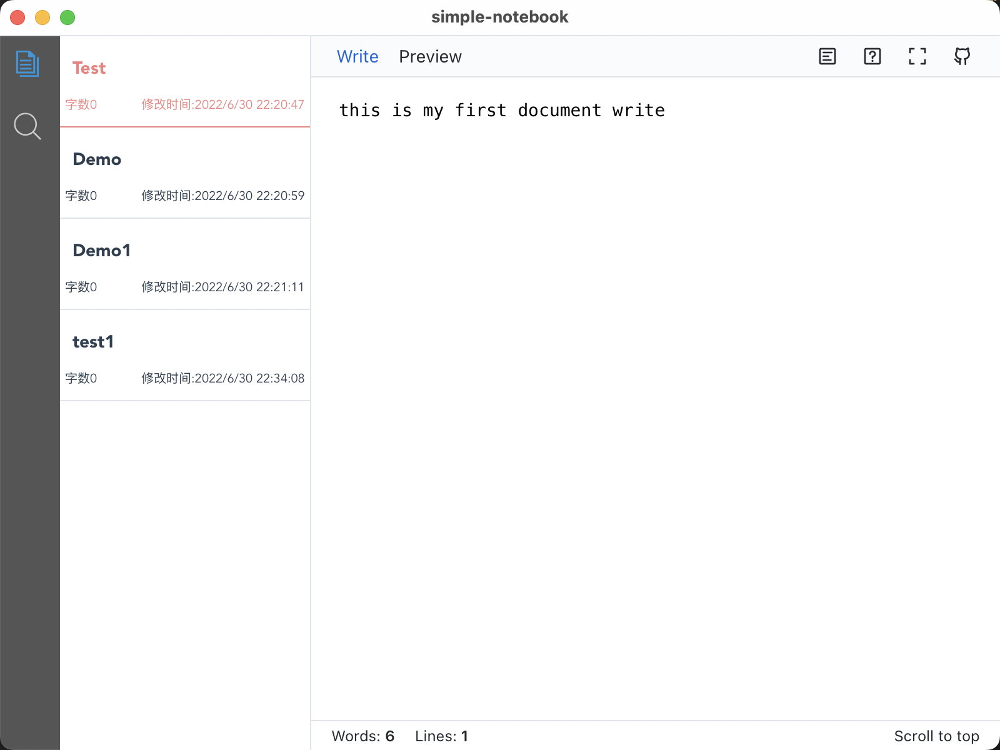

# Vue 3 + Vite + Tauri


## Project setup
```
npm install
```

### Compiles and hot-reloads for development
```
npm run tauri:dev
```

### Compiles and minifies for production
```
npm run tauri:build
```
